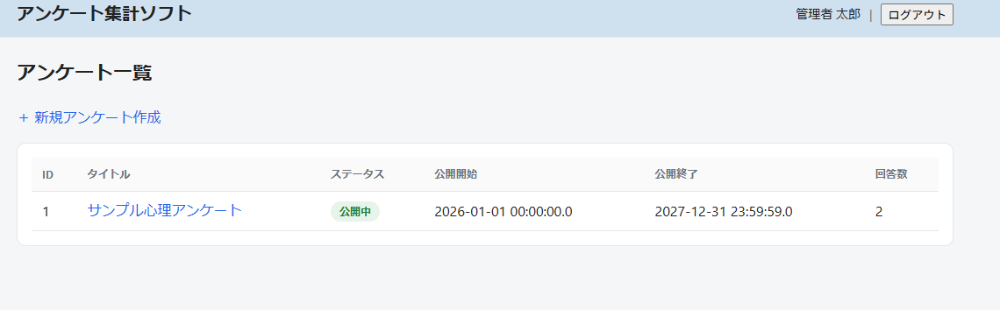
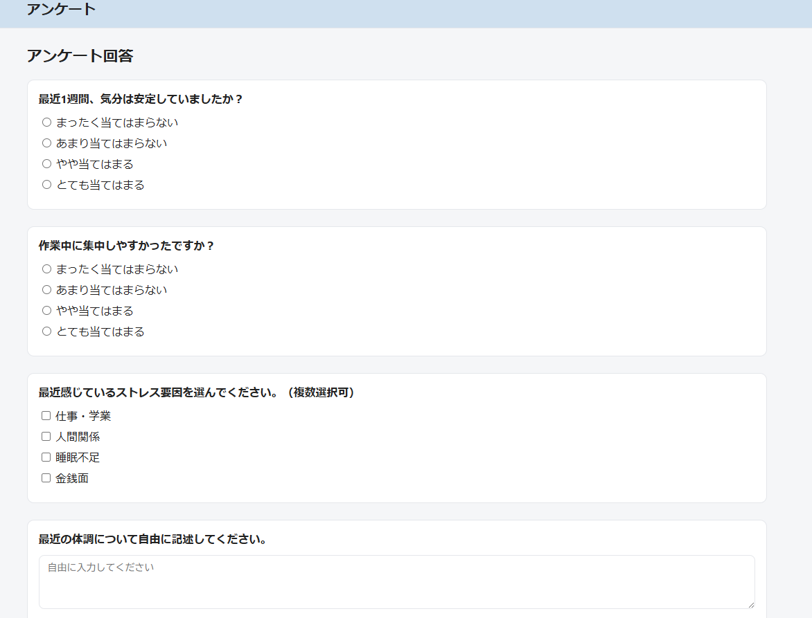
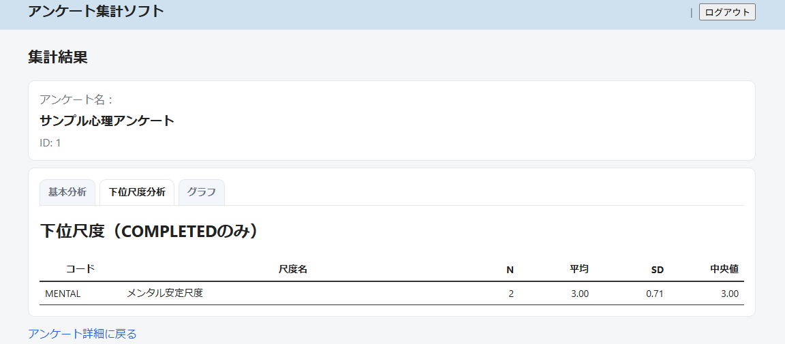
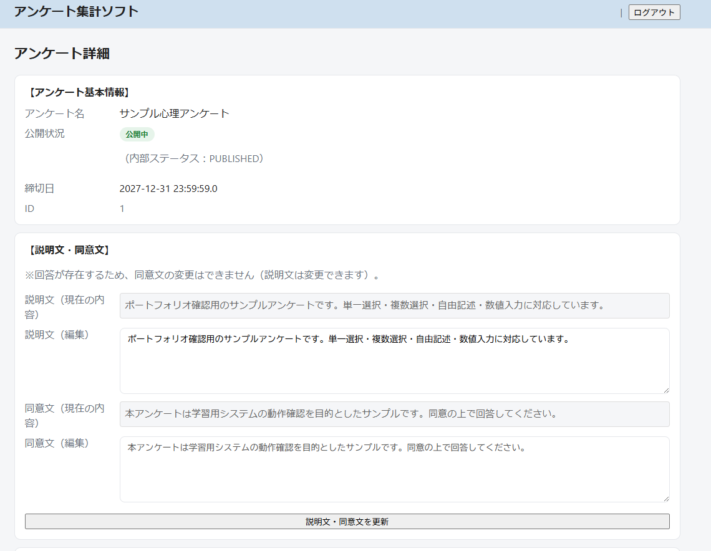
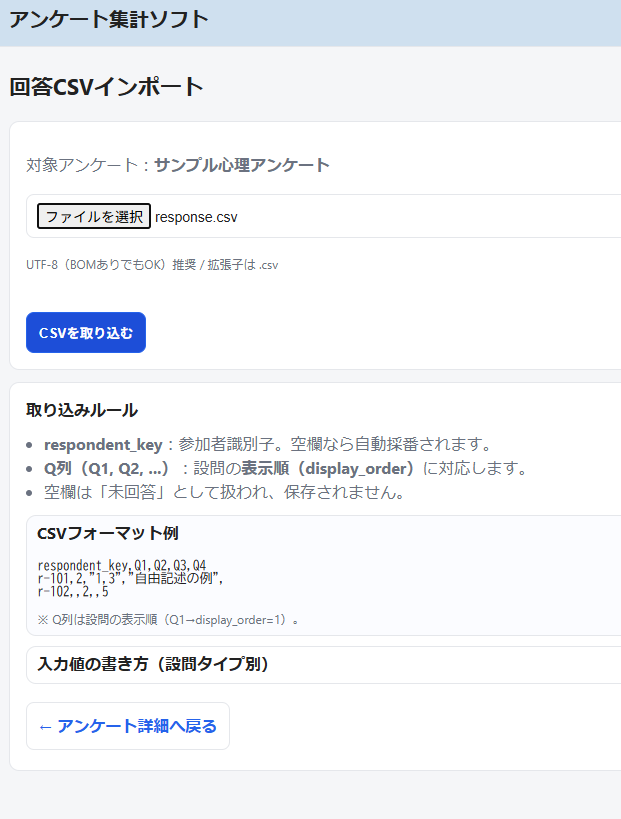

# アンケート集計アプリ（Survey Analysis App）

## 📌 概要

本アプリは、アンケートの作成・回答・集計・分析を行うWebアプリケーションです。
単一選択・複数選択・自由記述・数値入力に対応し、さらに下位尺度（スケール）による分析機能を実装しています。

また、CSVファイルによるデータインポート機能を備え、実務での利用を想定した設計となっています。

---

## 🛠 使用技術

* Java 17
* Spring Boot
* Spring JDBC（JdbcTemplate）
* Thymeleaf
* MySQL
* HTML / CSS

---

## 🚀 主な機能

### ■ アンケート管理

* アンケート作成・編集
* 公開期間設定（公開中 / 終了）
* 同意文の管理（回答後は編集制限）

### ■ 回答機能

* 単一選択（ラジオボタン）
* 複数選択（チェックボックス）
* 自由記述
* 数値入力

### ■ 集計・分析

* 回答数集計
* 平均・標準偏差・中央値
* 下位尺度（スケール）分析

### ■ CSVインポート

* 設問・選択肢・尺度・重みのインポート
* 回答データのインポート

---

## 📥 CSVインポート機能

以下のCSVファイルを用いてデータを登録できます。

* scales.csv（下位尺度）
* questions.csv（設問）
* question_options.csv（選択肢）
* scale_questions.csv（尺度重み）
* responses.csv（回答）

### 対応状況

* 単一選択（SINGLE_CHOICE）：対応
* 数値入力（NUMBER）：対応
* 自由記述（TEXT）：対応
* 複数選択（MULTI_CHOICE）：**CSVインポート未対応（画面入力は対応）**

※複数選択は1セルに複数値を持つ設計が必要なため、現状のCSVインポートでは未対応としています。

---

## 📸 画面イメージ

### アンケート一覧



### 回答画面



### 集計画面



### 管理画面



### CSVインポート



---

## ⚙️ セットアップ手順

### ① データベース作成

```sql
DROP DATABASE IF EXISTS survey_app;
CREATE DATABASE survey_app;
```

### ② テーブル作成

```text
sql/01_schema.sql を実行
```

### ③ 初期データ投入

```text
sql/02_seed.sql を実行
```

### ④ アプリケーション設定

`application-example.properties` をコピーして
`application-local.properties` を作成し、DB接続情報を設定してください。

例：

```properties
spring.datasource.url=jdbc:mysql://localhost:3306/survey_app
spring.datasource.username=root
spring.datasource.password=パスワード
```

### ⑤ アプリ起動

Spring Bootアプリケーションを起動

---

## 🔐 ログイン情報

* ログインID：admin
* パスワード：admin

---

## 📁 ディレクトリ構成

```text
survey-analysis-app/
├── src/
├── sql/
│   ├── 01_schema.sql
│   └── 02_seed.sql
├── sample_data/
│   ├── scales.csv
│   ├── questions.csv
│   ├── question_options.csv
│   ├── scale_questions.csv
│   └── responses.csv
├── docs/
│   └── screenshots/
├── README.md
```

---

## 🔧 今後の改善点

* 複数選択（MULTI_CHOICE）のCSVインポート対応
  → 「1|3」などの複数値を解析し、中間テーブルへ登録する機能を追加予定

* CSVインポートのバリデーション強化
  → エラー箇所の可視化・詳細表示

* UI/UXの改善
  → インポート結果のプレビュー表示や操作性向上

---

## ✨ 工夫した点

* JdbcTemplateを用いたシンプルなデータアクセス設計
* 設問・選択肢・尺度を分離した拡張性の高いデータモデル
* 回答後の同意文変更制限など、実務を意識した仕様
* CSVインポートによるデータ管理の効率化

---

## 📌 補足

本アプリはポートフォリオ用に作成したものであり、
実務を想定した設計・機能実装を意識しています。
